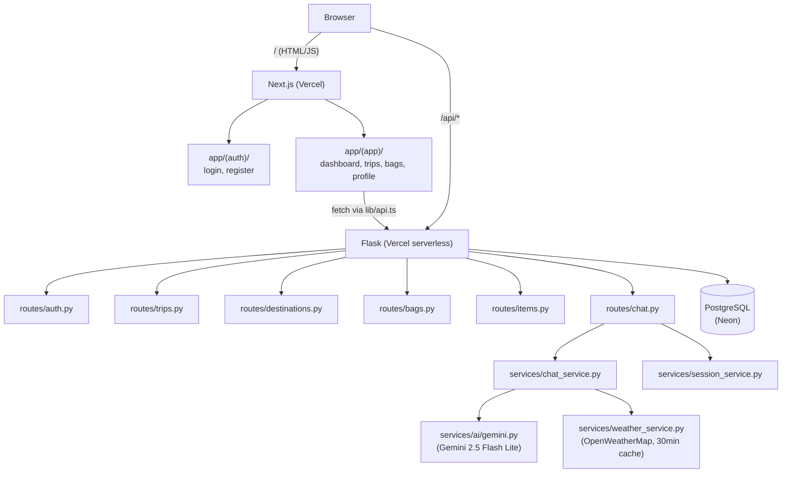
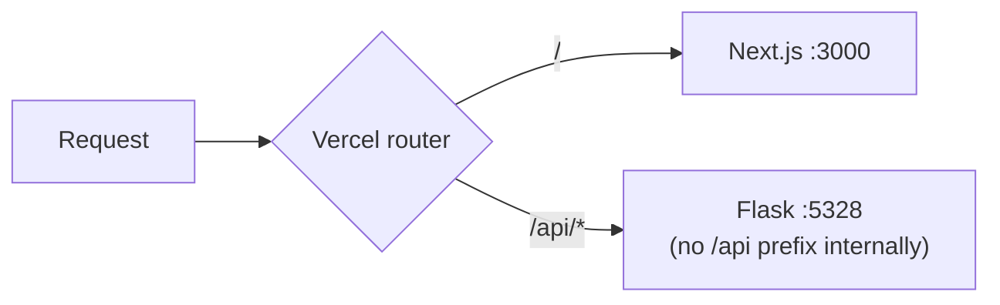
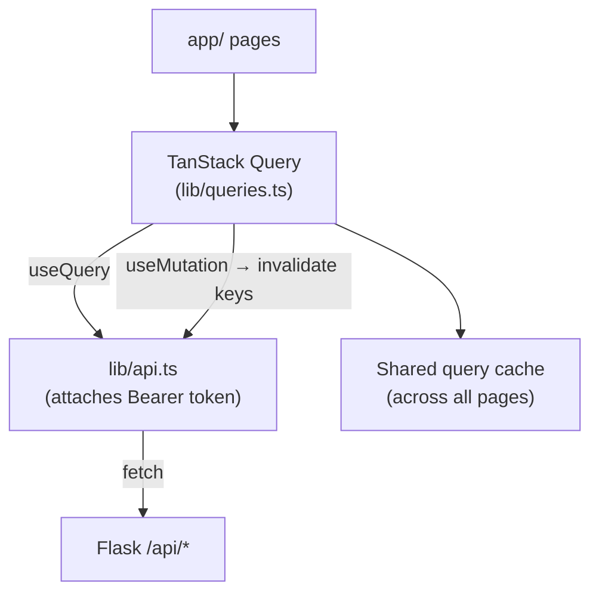
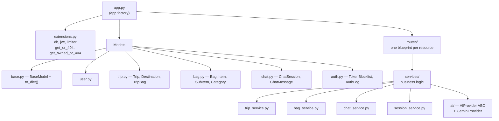
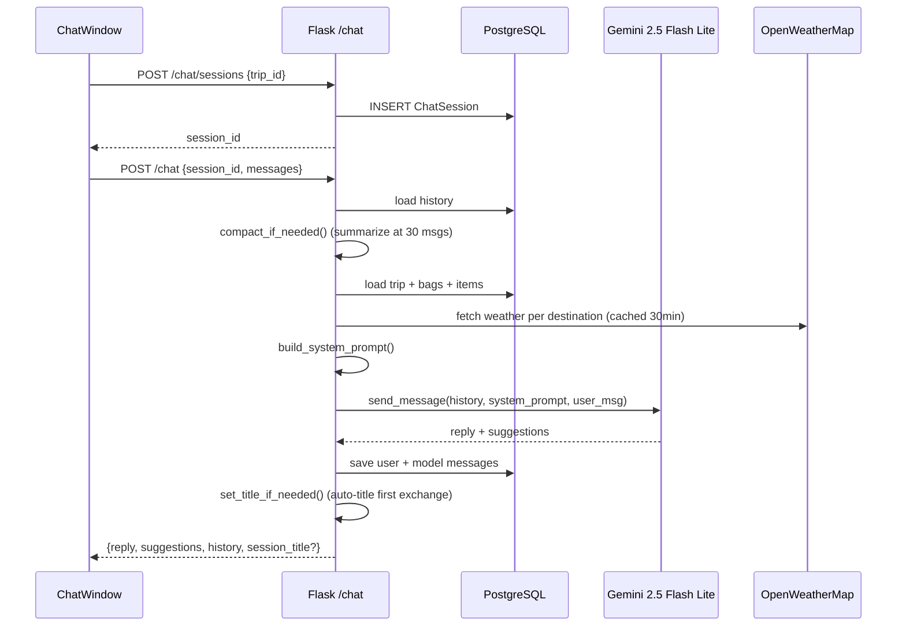
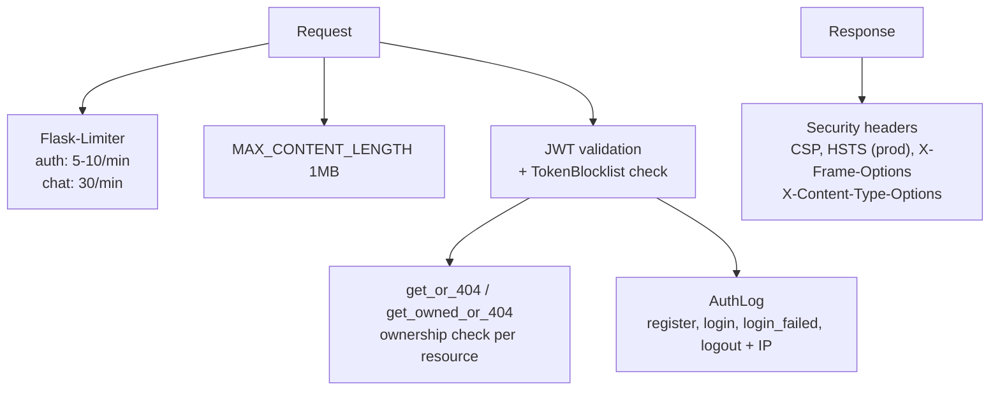

# Architecture

## Request flow

## Vercel routing

`NEXT_PUBLIC_API_URL` is empty in prod — requests go to the same origin at `/api`.

## Frontend data layer

Auth tokens stored in `localStorage`. Protected pages redirect to `/login` client-side if no token present.

## Backend structure

Ownership enforced via `get_or_404` / `get_owned_or_404` with dot-notation FK traversal (e.g. `"item.bag.user_id"` for sub-items).

## AI chat flow

## Security

