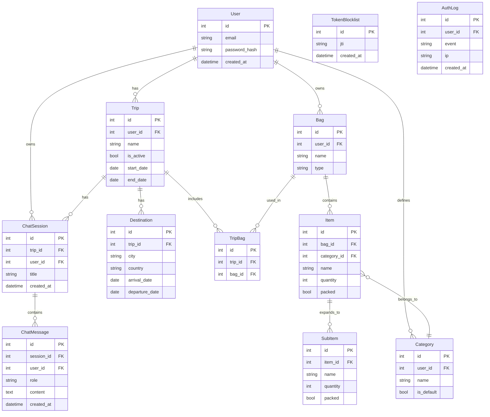

# Entity Relationship Diagram

## Notes

- `Category.user_id` — nullable. System defaults have no owner.
- `Trip.is_active` — enforces one active trip per user at a time.
- `Bag` belongs to the user, not the trip — reusable across trips.
- `TripBag` — junction table assigning bags to a specific trip.
- `Item.packed` — used when item has no sub-items.
- `SubItem.packed` — used when item is expanded. Item is considered packed when all sub-items are packed.
- `SubItem.quantity` — defaults to 1; `Item.quantity` aggregates sub-item quantities when expanded.
- `ChatSession` — one session = one chat thread per trip. Multiple sessions per trip supported.
- `ChatMessage.role` — `"user"` | `"model"` | `"summary"` (summaries are compacted history, excluded from UI).
- `TokenBlocklist` — stores JTI of revoked JWT access tokens (populated on logout).
- `AuthLog` — audit trail for `register`, `login`, `login_failed`, `logout` events.
