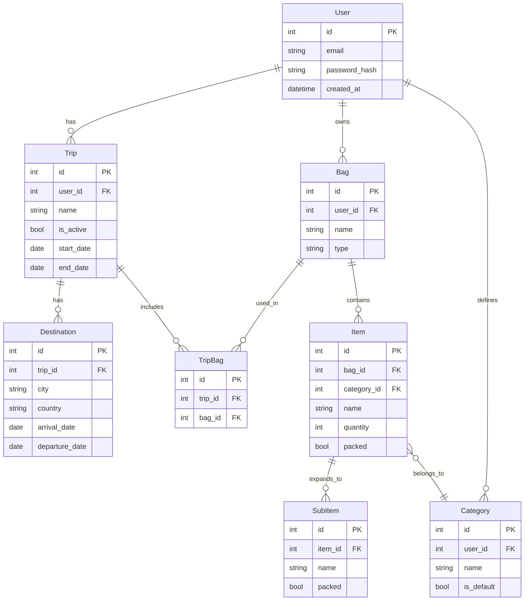

# Entity Relationship Diagram

## Notes

- `Category.user_id` — nullable. System defaults have no owner.
- `Trip.is_active` — enforces one active trip per user at a time.
- `Bag` belongs to the user, not the trip — reusable across trips.
- `TripBag` — junction table assigning bags to a specific trip.
- `Item.packed` — used when item has no subitems.
- `SubItem.packed` — used when item is expanded. Item is considered packed when all subitems are packed.
